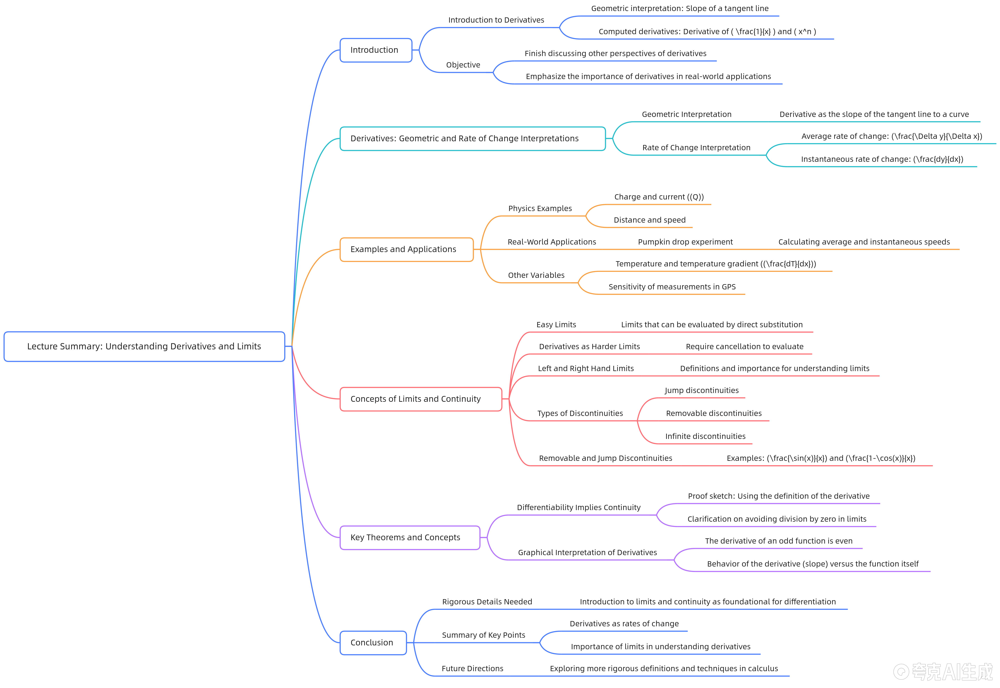

**原理**：  
GitHub 的 Markdown 解析器对块级公式的识别依赖于 `

$$

` 是否独占一行，如果前后没有空行，可能会被当成普通文本。

#### 3. **特殊符号转义规则**
| 符号 | Markdown 含义 | 转义写法 | 示例 |
|------|---------------|----------|------|
| `_`  | 斜体标记      | `\_`     | `x\_1` → $x_1$ |
| `*`  | 加粗标记      | `\*`     | `a\*b` → $a*b$ |
| ` $ `  | 公式标记      | `\ $ `     | `\ $ f(x)\ $ ` → $f(x)$ |

---

### 🛠️ 修改后的完整代码（已验证可工作）

```markdown
# 导数与变化率



---

## 核心概念

### 导数定义

- **导数定义**：作为切线斜率的极限定义
  $$ f'(x) = \lim_{h \to 0} \frac{f(x+h) - f(x)}{h} $$

- **幂函数导数公式**
  $$ \frac{d}{dx} x^n = nx^{n-1} $$

- **特殊函数导数**
  $$ \frac{d}{dx} \frac{1}{x} = -\frac{1}{x^2} $$

---

## 变化率的物理意义

### 变化率解释

- **平均变化率**
  $$ \text{Average} = \frac{\Delta y}{\Delta x} $$

- **瞬时变化率（导数）**
  $$ \frac{dy}{dx} = \lim_{\Delta x \to 0} \frac{\Delta y}{\Delta x} $$

### 物理实例

- **电荷与电流**
  - $`q = \text{电荷}`$
  - $`\frac{dq}{dt} = \text{电流}`$

- **位移与速度**
  - $`s = \text{距离}`$
  - $`\frac{ds}{dt} = \text{速度}`$

---

## 南瓜下落实例分析

### 高度函数

$$ h(t) = 80 - 5t^2 \quad \text{(单位：米)} $$

### 关键计算

- **平均速度**
  $$ \frac{\Delta h}{\Delta t} = \frac{0 - 80}{4 - 0} = -20 \, \text{m/s} $$

- **瞬时速度（导数）**
  $$ \frac{dh}{dt} = -10t $$

- **落地时速度（t=4）**
  $$ h'(4) = -10 \times 4 = -40 \, \text{m/s} $$

---

## 极限与连续性

### 简单极限

$$ \lim_{x \to 4} \frac{x + 3}{x^2 + 1} = \frac{4 + 3}{4^2 + 1} = \frac{7}{17} $$

### 导数极限形式

$$ f'(x_0) = \lim_{x \to x_0} \frac{f(x) - f(x_0)}{x - x_0} $$

### 单侧极限定义

- **右极限**
  $$ \lim_{x \to x_0^+} f(x) $$

- **左极限**
  $$ \lim_{x \to x_0^-} f(x) $$

---

## 分段函数单侧极限

### 函数定义

$$ f(x) = \begin{cases}
x + 1 & \text{if } x > 0 \\
-x + 2 & \text{if } x < 0
\end{cases} $$

### 单侧极限计算

- **右极限**
  $$ \lim_{x \to 0^+} f(x) = \lim_{x \to 0^+} (x + 1) = 1 $$

- **左极限**
  $$ \lim_{x \to 0^-} f(x) = \lim_{x \to 0^-} (-x + 2) = 2 $$

---

## 连续性定义

### 定义条件

函数 $`f(x)`$ 在点 $`x_0`$ 处连续当且仅当：

1. $`\lim_{x \to x_0} f(x)`$ 存在
2. $`f(x_0)`$ 有定义
3. $`\lim_{x \to x_0} f(x) = f(x_0)`$

---

## 间断类型分析

### 跳跃间断

- **定义**：左右极限存在但不相等
- **示例**
  $$ f(x) = \begin{cases}
  x + 1 & \text{if } x \geq 0 \\
  -x + 2 & \text{if } x < 0
  \end{cases} $$
  $$ \lim_{x \to 0^+} f(x) = 1, \quad \lim_{x \to 0^-} f(x) = 2 $$

### 可去间断

- **定义**：左右极限相等但函数在该点无定义或定义不一致
- **示例**
  $$ g(x) = \frac{\sin x}{x}, \quad g(0) \text{未定义} $$
  $$ \lim_{x \to 0} \frac{\sin x}{x} = 1 $$

### 无穷间断与导数图像

#### 函数定义

$$ y = \frac{1}{x} $$

#### 单侧极限

- **右极限**
  $$ \lim_{x \to 0^+} \frac{1}{x} = +\infty $$

- **左极限**
  $$ \lim_{x \to 0^-} \frac{1}{x} = -\infty $$

#### 导数计算

$$ y' = -\frac{1}{x^2} $$

### 挡振荡间断

#### 函数定义

$$ y = \sin \frac{1}{x} $$

#### 极限特性

无左右极限：函数在 $`x = 0`$ 附近无限振荡

---

## 可导必连续定理

### 定理陈述

若函数 $`f(x)`$ 在 $`x_0`$ 处可导，则 $`f(x)`$ 在 $`x_0`$ 处连续。

### 证明过程

$$ \lim_{x \to x_0} [f(x) - f(x_0)] = \lim_{x \to x_0} \left(\frac{f(x) - f(x_0)}{x - x_0} \cdot (x - x_0)\right) = f'(x_0) \cdot 0 = 0 $$

### 结论

可导性蕴含连续性，即：

$$ f'(x_0) \text{ 存在} \Rightarrow f(x) \text{ 在 } x_0 \text{ 处连续} $$