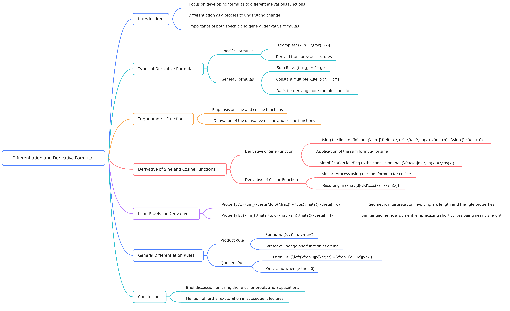
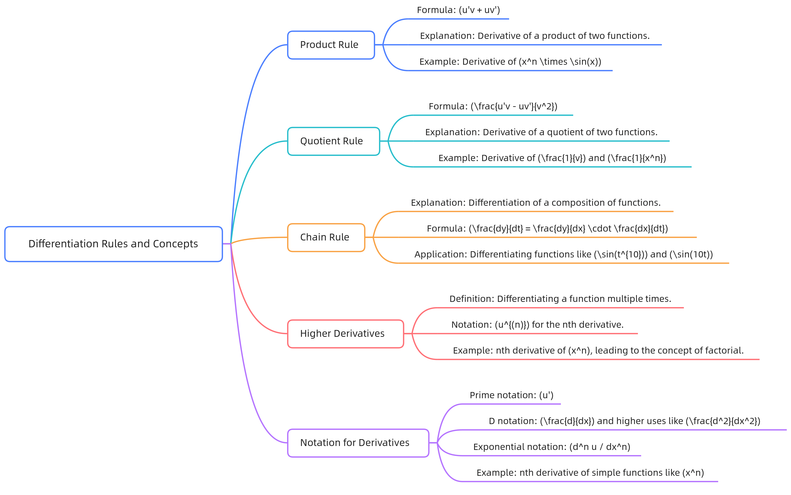
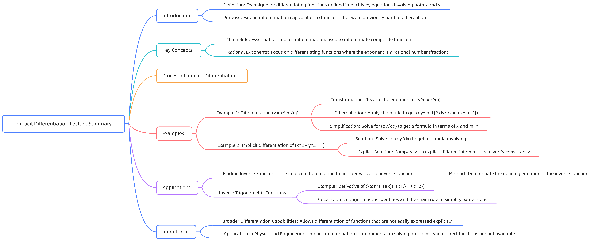

# 微积分 — 导数专题笔记 (03–05)

本文档由 03、04、05 三节课的 Word 文档（AI 总结）合并整理而成。  
> 数学公式遵循 GitHub Markdown 语法：行内用 `$…$`，块级用 `$$…$$`。

## 03 求导四则运算及三角函数导数

本视频讲述了三角函数导数公式的推导过程，重点通过差商和三角恒等式详细推导了正弦函数的导数为余弦函数，并利用和角公式推导了余弦函数的导数为负的正弦函数；同时通过几何方法证明了当θ趋近于0时，sinθ/θ趋近于1以及(1−cosθ)/θ趋近于0，强调了弧度制在三角函数极限中的关键作用；最后介绍了适用于更一般情况的导数运算法则——乘积法则和商法则。

### 三角函数导数公式推导
### 导数公式概述

- 本节课重点讲解三角函数的导数公式

  - 通过差商和三角恒等式推导 $\sin x$ 和 $\cos x$ 的导数

  - 推导过程中使用极限性质和几何证明

### 正弦函数导数推导
差商表达式

 $\frac{d}{dx}\sin x = \lim_{\Delta x \to 0}\frac{\sin\left( x + \Delta x \right) - \sin x}{\Delta x}$

使用三角恒等式展开

 $\sin\left( x + \Delta x \right) = \sin x\cos\Delta x + \cos x\sin\Delta x$

化简差商

 $\frac{\sin\left( x + \Delta x \right) - \sin x}{\Delta x} = \frac{\sin x\cos\Delta x + \cos x\sin\Delta x - \sin x}{\Delta x} = \sin x\left( \frac{\cos\Delta x - 1}{\Delta x} \right) + \cos x\left( \frac{\sin\Delta x}{\Delta x} \right)$

### 利用极限性质

  -  $\lim_{\Delta x \to 0}\frac{\cos\Delta x - 1}{\Delta x} = 0$

  -  $\lim_{\Delta x \to 0}\frac{\sin\Delta x}{\Delta x} = 1$

最终结果

 $\frac{d}{dx}\sin x = \cos x$

### 余弦函数导数推导
差商表达式

 $\frac{d}{dx}\cos x = \lim_{\Delta x \to 0}\frac{\cos\left( x + \Delta x \right) - \cos x}{\Delta x}$

使用三角恒等式展开

 $\cos\left( x + \Delta x \right) = \cos x\cos\Delta x - \sin x\sin\Delta x$

化简差商

 $\frac{\cos\left( x + \Delta x \right) - \cos x}{\Delta x} = \frac{\cos x\cos\Delta x - \sin x\sin\Delta x - \cos x}{\Delta x} = \cos x\left( \frac{\cos\Delta x - 1}{\Delta x} \right) - \sin x\left( \frac{\sin\Delta x}{\Delta x} \right)$

### 利用极限性质

  -  $\lim_{\Delta x \to 0}\frac{\cos\Delta x - 1}{\Delta x} = 0$

  -  $\lim_{\Delta x \to 0}\frac{\sin\Delta x}{\Delta x} = 1$

最终结果

 $\frac{d}{dx}\cos x = - \sin x$

### 导数在零点的重要性
零点导数计算

 $\left. \ \frac{d}{dx}\cos x \right|_{x = 0} = \lim_{\Delta x \to 0}\frac{\cos\left( \Delta x \right) - 1}{\Delta x} = 0$

 $\left. \ \frac{d}{dx}\sin x \right|_{x = 0} = \lim_{\Delta x \to 0}\frac{\sin\Delta x}{\Delta x} = 1$

### 关键结论

  - 通过零点导数可以推导出所有点的导数

  -  $\frac{d}{dx}\sin x$ 和 $\frac{d}{dx}\cos x$ 的值由零点导数决定

### 几何证明：
 $\lim_{\theta \to 0}\frac{\sin\theta}{\theta} = 1$

### 几何构造

  - 画单位圆，设角 $\theta$ ，对应的弧长为 $\theta$

  - 垂直距离为 $\sin\theta$

### 关键观察

  - 当 $\theta \to 0$ 时，弧长和垂直距离趋近于相等

  - 短曲线近似为直线

推导过程

 $\frac{2\sin\theta}{2\theta} = \frac{\sin\theta}{\theta} \to 1\text{ as }\theta \to 0$

结论

 $\lim_{\theta \to 0}\frac{\sin\theta}{\theta} = 1$

### 几何证明：
 $\lim_{\theta \to 0}\frac{1 - \cos\theta}{\theta} = 0$

### 几何构造

  - 画单位圆，设角 $\theta$ ，对应的弧长为 $\theta$

  - 垂直距离为 $\cos\theta$

### 关键观察

  - 当 $\theta \to 0$ 时，弧长和垂直距离趋近于相等

  - 短曲线近似为直线

推导过程

 $\frac{1 - \cos\theta}{\theta} \to 0\text{ as }\theta \to 0$

结论

 $\lim_{\theta \to 0}\frac{1 - \cos\theta}{\theta} = 0$

### 弧度制的重要性
### 关键点

  - 所有三角函数的极限计算都基于弧度制

  - 如果使用角度制，结果会错误

### 数学原理

  - 弧长公式： $\text{arc length} = r\theta$ ，其中 $\theta$ 是弧度

  - 单位圆中， $\theta$ 的弧长等于 $\theta$

### 结论

  - 所有三角函数的导数公式都基于弧度制

### 几何证明：
 $\frac{d}{d\theta}\sin\theta = \cos\theta$

### 几何构造

  - 画单位圆，设角 $\theta$ ，对应的点 $P$

  - 移动角 $\Delta\theta$ ，得到点 $Q$

### 关键观察

  -  $\Delta y = PR$ ，其中 $R$ 是 $Q$ 在 $P$ 的垂直投影

  -  $PQ \approx \Delta\theta$ ，且 $PQ \perp OP$

### 推导过程

  -  $\angle QPR \approx \theta$

  -  $\Delta y \approx \Delta\theta\cos\theta$

最终结果

 $\frac{d}{d\theta}\sin\theta = \cos\theta$

### 通用求导法则介绍
乘积法则

 $\left( uv \right)^{'} = u^{'}v + uv^{'}$

商法则

 $\left( \frac{u}{v} \right)^{'} = \frac{u^{'}v - uv^{'}}{v^{2}}$

### 关键点

  - 这些法则适用于多个函数的组合

  - 下节课将详细证明这些法则

### 结论

  - 乘积法则和商法则是求导的重要工具

  - 学生需掌握这些法则的证明

## 04 链式法则及高阶导数

本视频讲述了微积分中导数的三大基本法则（乘积法则、商法则、链式法则）及其严格推导过程，并拓展至高阶导数的概念与记号，通过具体函数示例（如 $x^{n}$ 、 $\sin x$ 、 $\sin^{10}t$ 、 $\frac{1}{x^{n}}$ 等）验证各法则的应用与一致性。

### 课程导入与预备知识回顾

  - 教师介绍与课程定位 主讲人为 Haynes Miller，代 David Jerison 授课；课程处于微分学基础阶段，已学习幂函数与正弦函数的导数定义及基本求导规则。

  - 已有求导规则复述 幂函数导数： $\frac{d}{dx}\left( x^{n} \right) = nx^{n - 1}$ 。

  - 正弦函数导数 $\frac{d}{dx}\left( \sin x \right) = \cos x$ 。

  - 线性性规则 常数倍法则： $\left( cu \right)^{'} = cu^{'}$ 。

  - 和法则 $\left( u + v \right)^{'} = u^{'} + v^{'}$ 。

### 乘积法则（Product Rule）

  - 法则陈述 $\left( uv \right)^{'} = u^{'}v + uv^{'}$ 。

  - 应用示例： $x^{n}\sin x$ 的导数 设 $u = x^{n}$ ， $v = \sin x$ ，则： $u^{'} = nx^{n - 1}$ ， $v^{'} = \cos x$ ，故 $\frac{d}{dx}\left( x^{n}\sin x \right) = nx^{n - 1}\sin x + x^{n}\cos x$ 。

  - 严格推导
    
      - 考察增量： $\Delta\left( uv \right) = u\left( x + \Delta x \right)v\left( x + \Delta x \right) - u\left( x \right)v\left( x \right)$ 。
    
      - 拆项重构： $\Delta\left( uv \right) = \left\lbrack u\left( x + \Delta x \right) - u\left( x \right) \right\rbrack v\left( x + \Delta x \right) + u\left( x \right)\left\lbrack v\left( x + \Delta x \right) - v\left( x \right) \right\rbrack$ 。
    
      - 除以 $\Delta x$ 得差商： $\frac{\Delta\left( uv \right)}{\Delta x} = \frac{\Delta u}{\Delta x}v\left( x + \Delta x \right) + u\left( x \right)\frac{\Delta v}{\Delta x}$ 。
    
      - 取极限 $\Delta x \to 0$ ，利用 $v$ 的连续性得： $\left( uv \right)^{'} = u^{'}v + uv^{'}$ 。

### 商法则（Quotient Rule）

  - 法则陈述 $\left( \frac{u}{v} \right)^{'} = \frac{u^{'}v - uv^{'}}{v^{2}}$ 。

  - 推导过程
    
      - 增量表达式： $\Delta\left( \frac{u}{v} \right) = \frac{u + \Delta u}{v + \Delta v} - \frac{u}{v}$ 。
    
      - 通分化简： $\Delta\left( \frac{u}{v} \right) = \frac{\left( u + \Delta u \right)v - u\left( v + \Delta v \right)}{v\left( v + \Delta v \right)} = \frac{\Delta u \cdot v - u \cdot \Delta v}{v\left( v + \Delta v \right)}$ 。
    
      - 除以 $\Delta x$ 并取极限： $\left( \frac{u}{v} \right)^{'} = \frac{u^{'}v - uv^{'}}{v^{2}}$ （因 $\Delta v \to 0$ ，故 $v + \Delta v \to v$ ）。

  - 特例：倒数函数导数 令 $u = 1$ ，则 $\left( \frac{1}{v} \right)^{'} = - \frac{v^{'}}{v^{2}}$ 。

  - 应用： $x^{- n}$ 的导数 设 $v = x^{n}$ ，则： $\frac{d}{dx}\left( x^{- n} \right) = - \frac{nx^{n - 1}}{x^{2n}} = - nx^{- n - 1}$ ，验证幂函数求导公式对负整数指数仍成立。

### 链式法则（Chain Rule）

  - 法则陈述与直观推导 若 $y = f\left( x \right)$ ， $x = g\left( t \right)$ ，则 $\frac{dy}{dt} = \frac{dy}{dx} \cdot \frac{dx}{dt}$ 。
    
      - 差商形式： $\frac{\Delta y}{\Delta t} = \frac{\Delta y}{\Delta x} \cdot \frac{\Delta x}{\Delta t}$ （ $\Delta x \neq 0$ ）。
    
      - 取极限得导数关系。

  - 应用示例一： $\sin^{10}t$
    
      - 设 $x = \sin t$ （内函数）， $y = x^{10}$ （外函数）。
    
      -  $\frac{dy}{dx} = 10x^{9}$ ， $\frac{dx}{dt} = \cos t$ 。
    
      - 代回： $\frac{d}{dt}\left( \sin^{10}t \right) = 10\sin^{9}t \cdot \cos t$ 。

  - 应用示例二： $\sin\left( 10t \right)$
    
      - 设 $x = 10t$ ， $y = \sin x$ 。
    
      -  $\frac{dy}{dx} = \cos x$ ， $\frac{dx}{dt} = 10$ 。
    
      - 结果： $\frac{d}{dt}\left( \sin\left( 10t \right) \right) = 10\cos\left( 10t \right)$ 。

### 高阶导数（Higher Derivatives）

  - 定义与记号
    
      - 一阶导数： $u^{'}$ 或 $\frac{du}{dx}$ 。
    
      - 二阶导数： $u^{'}' = \frac{d}{dx}\left( u^{'} \right) = \frac{d^{2}u}{dx^{2}}$ 。
    
      -  $n$ 阶导数： $u^{\left( n \right)} = \frac{d^{n}u}{dx^{n}}$ 或 $D^{n}u$ 。

  - 正弦函数的周期性高阶导数
    
      -  $u = \sin x$ ： $u^{'} = \cos x$ ， $u^{'}' = - \sin x$ ， $u^{'}'^{'} = - \cos x$ ， $u^{\left( 4 \right)} = \sin x$ 。
    
      - 每四阶循环一次。

  - 幂函数 $x^{n}$ 的高阶导数
    
      -  $D^{k}\left( x^{n} \right) = n\left( n - 1 \right)\cdots\left( n - k + 1 \right)x^{n - k}$ （ $k \leq n$ ）。
    
      -  $D^{n}\left( x^{n} \right) = n!$ （常数）。
    
      -  $D^{n + 1}\left( x^{n} \right) = 0$ （常数的导数为零）。

### 总结与延伸说明

  - 本课系统构建了导数运算的核心工具链：乘积、商、链式法则构成处理复合初等函数的基础；高阶导数记号（ $D^{n}$ 、 $\frac{d^{n}}{dx^{n}}$ ）统一表达了反复求导操作。

  - 所有法则均从导数定义出发严格推导，确保逻辑自洽；示例计算验证了法则在正、负整数幂及三角函数上的普适性。

## 05 隐函数微分法和逆函数导数

本视频讲述了隐函数求导（implicit differentiation）的核心思想与应用，包括利用该方法推导有理数幂函数的导数公式、求解圆方程和高次隐式方程的导数，并系统推导反三角函数（arctan x 和 arcsin x）的导数公式，强调其在处理无法显式解出y的函数时的简洁性与普适性。

### 课程导引与核心概念引入

  - 课程定位与目标 本讲承接前序关于链式法则（chain rule）的内容，聚焦于隐函数求导这一关键技巧，旨在扩展可微函数的范围。

  - 隐函数求导定义 隐函数求导是一种允许对大量此前无法直接求导的函数进行微分的技术。

例题1：有理数幂函数 $y = x^{\frac{m}{n}}$ 的导数推导

  - 设定与转化 设 $y = x^{\frac{m}{n}}$ ，其中 $m,n$ 为整数， $n \neq 0$ 。

  - 消去分数指数 两边取 $n$ 次幂得： $y^{n} = x^{m}$ 。

  - 对等式两边关于 $x$ 求导 $\frac{d}{dx}\left( y^{n} \right) = \frac{d}{dx}\left( x^{m} \right)$ 。

  - 应用链式法则 左边： $\frac{d}{dx}\left( y^{n} \right) = \frac{d}{dy}\left( y^{n} \right) \cdot \frac{dy}{dx} = ny^{n - 1}\frac{dy}{dx}$ ；右边： $\frac{d}{dx}\left( x^{m} \right) = mx^{m - 1}$ 。

  - 整理方程 $ny^{n - 1}\frac{dy}{dx} = mx^{m - 1}$ 。

  - 解出 $\frac{dy}{dx}$ $\frac{dy}{dx} = \frac{mx^{m - 1}}{ny^{n - 1}}$ 。

  - 代入 $y = x^{\frac{m}{n}}$ 并化简指数 $\frac{dy}{dx} = \frac{m}{n}x^{m - 1} \cdot x^{- \frac{m\left( n - 1 \right)}{n}} = \frac{m}{n}x^{\frac{m}{n} - 1}$ 。

  - 结论 $\frac{d}{dx}\left( x^{a} \right) = ax^{a - 1}$ 对任意有理数 $a = m/n$ 成立。

例题2：单位圆隐式方程 $x^{2} + y^{2} = 1$ 的导数

  - 显式解法（对比） 解得 $y = \pm \sqrt{1 - x^{2}}$ ，取正支 $y = \left( 1 - x^{2} \right)^{\frac{1}{2}}$ ；应用链式法则： $y^{'} = \frac{1}{2}\left( 1 - x^{2} \right)^{\frac{- 1}{2}} \cdot \left( - 2x \right) = - \frac{x}{\sqrt{1 - x^{2}}}$ 。

  - 隐函数求导法 对 $x^{2} + y^{2} = 1$ 两边关于 $x$ 求导： $2x + 2yy^{'} = 0$ ；解得： $y^{'} = - \frac{x}{y}$ 。

  - 一致性验证 将 $y = \sqrt{1 - x^{2}}$ 代入隐式结果，得 $y^{'} = - \frac{x}{\sqrt{1 - x^{2}}}$ ，与显式结果一致；隐式法自动涵盖正负两支，因 $y$ 符号已内含于表达式中。

例题3：四次隐式方程 $y^{4} + xy^{2} - 2 = 0$ 的导数

  - 隐函数求导步骤 对方程两边关于 $x$ 求导： $\frac{d}{dx}\left( y^{4} \right) + \frac{d}{dx}\left( xy^{2} \right) - \frac{d}{dx}\left( 2 \right) = 0$ ；得： $4y^{3}y^{'} + \left( y^{2} + x \cdot 2yy^{'} \right) = 0$ （乘积法则）。

  - 整理并解出 $y^{'}$ $y^{'}\left( 4y^{3} + 2xy \right) = - y^{2}$ ； $y^{'} = - \frac{y^{2}}{4y^{3} + 2xy}$ 。

  - 具体点处斜率计算 当 $x = 1$ 时， $y = 1$ 满足原方程；代入得： $y^{'}|_{\left( 1,1 \right)} = - \frac{1}{6}$ 。

  - 方法优势说明 无需显式解出 $y\left( x \right)$ （该方程显式解含多重根号，极复杂），仅需已知点 $\left( x,y \right)$ 即可快速求得斜率。

### 隐函数求导的核心应用：反函数导数公式

  - 一般原理 若 $y = f^{- 1}\left( x \right)$ ，则 $f\left( y \right) = x$ ；对两边关于 $x$ 求导得： $f^{'}\left( y \right) \cdot y^{'} = 1$ ，故 $y^{'} = \frac{1}{f^{'}\left( y \right)} = \frac{1}{f^{'}\left( f^{- 1}\left( x \right) \right)}$ 。

反三角函数导数推导： $\frac{d}{dx}\left( \tan^{- 1}x \right)$

  - 设定与关系 设 $y = \tan^{- 1}x$ ，则 $\tan y = x$ ，且 $y \in \left( - \frac{\pi}{2},\frac{\pi}{2} \right)$ 。

  - 求导与链式法则 $\frac{d}{dx}\left( \tan y \right) = \frac{d}{dy}\left( \tan y \right) \cdot \frac{dy}{dx} = \sec^{2}y \cdot y^{'} = 1$ ；故 $y^{'} = \cos^{2}y$ 。

  - 三角恒等式转化 由 $\tan y = x$ 构造直角三角形：对边 $x$ ，邻边 $1$ ，斜边 $\sqrt{1 + x^{2}}$ ； $\cos y = \frac{1}{\sqrt{1 + x^{2}}}$ ，故 $\cos^{2}y = \frac{1}{1 + x^{2}}$ 。

  - 最终公式 $\frac{d}{dx}\left( \tan^{- 1}x \right) = \frac{1}{1 + x^{2}}$ 。

反三角函数导数推导： $\frac{d}{dx}\left( \sin^{- 1}x \right)$

  - 设定与关系 设 $y = \sin^{- 1}x$ ，则 $\sin y = x$ ，且 $y \in \left\lbrack - \frac{\pi}{2},\frac{\pi}{2} \right\rbrack$ 。

  - 求导与链式法则 $\frac{d}{dx}\left( \sin y \right) = \cos y \cdot y^{'} = 1$ ，故 $y^{'} = \frac{1}{\cos y}$ 。

  - 三角恒等式转化 $\cos y = \sqrt{1 - \sin^{2}y} = \sqrt{1 - x^{2}}$ （在指定区间 $\cos y \geq 0$ ）；故 $y^{'} = \frac{1}{\sqrt{1 - x^{2}}}$ 。

  - 最终公式 $\frac{d}{dx}\left( \sin^{- 1}x \right) = \frac{1}{\sqrt{1 - x^{2}}}$ 。
